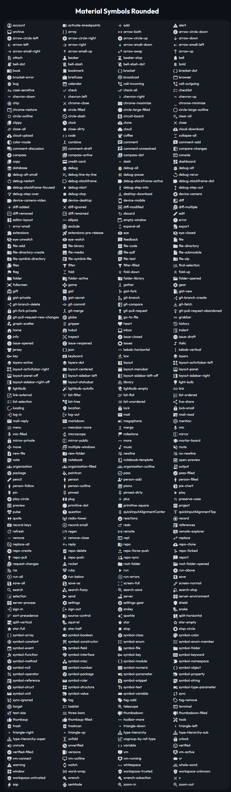

# Material Symbols VSCode Product Icons

Adds the new [Material Symbols](https://fonts.google.com/icons?icon.style=Rounded) to VSCode's interface, using the rounded filled variants for most icons and rounded outlined variants for some icon variations.

## All icons

This is the mapping of every product icon supported.

