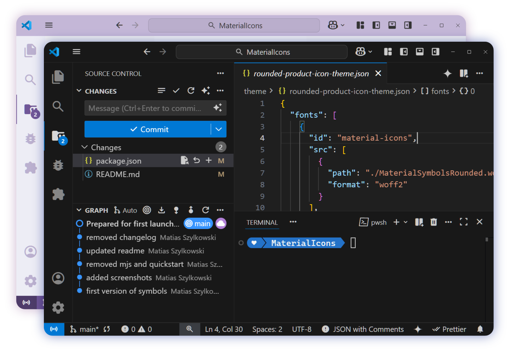

# Material Symbols VSCode Product Icons

Adds the new [Material Symbols](https://fonts.google.com/icons?icon.style=Rounded) to VSCode's interface, using the rounded filled variants for most icons and rounded outlined variants for some icon variations.

## All icons

This is the mapping of every product icon supported.

## References

- [Google Icons](https://fonts.google.com/icons)
- [microsoft/vscode-extension-samples](https://github.com/microsoft/vscode-extension-samples)
- [material-extensions/vscode-material-product-icons](https://github.com/material-extensions/vscode-material-product-icons)
